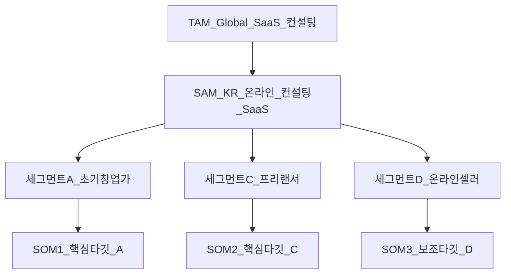

## 1. 분석 개요

- **분석 대상 시장**: SaaS형 온라인 비즈니스 컨설팅 서비스  
  - 예시 서비스: “초보 창업가를 위한 3단계 종합 진단 온라인 컨설팅” (웹 기반 SaaS, 자가진단 + 자동 리포트 + 실행 로드맵 제공)  
  - 참고 보고서: `[5_SaaS형_온라인_비즈니스_컨설팅_TAM-SAM-SOM_핵심_원인_Market_Segment_분석_보고서.pdf](file:///c%3A/Users/moonh/Documents/workspace/BA-to-SW-Dev_1/2_%ED%95%B5%EC%8B%AC%EC%98%88%EC%A0%9C%20%EB%B6%84%EC%84%9D%EC%9E%90%EB%A3%8C/5_SaaS%E1%84%92%E1%85%A7%E1%86%BC_%E1%84%8B%E1%85%A9%E1%86%AB%E1%84%85%E1%85%A1%E1%84%8B%E1%85%B5%E1%86%AB_%E1%84%87%E1%85%B5%E1%84%8C%E1%85%B3%E1%84%82%E1%85%B5%E1%84%89%E1%85%B3_%E1%84%8F%E1%85%A5%E1%86%AB%E1%84%89%E1%85%A5%E1%86%AF%E1%84%90%E1%85%B5%E1%86%BC_TAM-SAM-SOM_%E1%84%92%E1%85%A2%E1%86%A8%E1%84%89%E1%85%B5%E1%86%B7_%E1%84%8B%E1%85%AF%E1%86%AB%E1%84%8B%E1%85%B5%E1%86%AB_Market_Segment_%E1%84%87%E1%85%AE%E1%86%AB%E1%84%89%E1%85%A5%E1%86%A8_%E1%84%87%E1%85%A9%E1%84%80%E1%85%A9%E1%84%89%E1%85%A5.pdf)`  
    - 글로벌 컨설팅 시장의 정의 범위별 규모 편차와, SME/온라인 세그먼트의 고성장성(CAGR)을 핵심 인사이트로 활용함.
- **참고 방법론**  
  - `1_ 시장 및 비즈니스 분석 방법론/5_TAM-SAM-SOM_과_Market_Segment_Map.md`  
  - `1_ 시장 및 비즈니스 분석 방법론/6-3_심층리서치_수행을_위한_방법론.md`

> 주의: 아래 수치는 위 보고서의 정성·정량 인사이트를 기반으로 한 **실제에 근접한 추정 시나리오**이며, 투자 의사결정 등에서는 최신 통계(통계청, 중기부 등)로 재검증이 필요합니다.

---

## 2. 핵심 결과 요약 (TAM / SAM / SOM)

### 2-1. 요약 지표 (USD 기준, 1 USD ≈ 1,300 KRW 가정)

| 구분 | 비관 시나리오 | 기준 시나리오 | 낙관 시나리오 | 설명 |
| --- | --- | --- | --- | --- |
| **TAM** (글로벌 SaaS 비즈니스 컨설팅) | 약 **4.0 B USD** (약 5.2조 원) | 약 **12.5 B USD** (약 16.3조 원) | 약 **91.4 B USD** (약 118.9조 원) | 글로벌 비즈니스/매니지먼트 컨설팅 중 SMB·SaaS 비중만 반영 |
| **SAM_top** (한국 Top-down) | 약 **0.06 B USD** (약 780억 원) | 약 **0.25 B USD** (약 3,250억 원) | 약 **2.74 B USD** (약 3.56조 원) | TAM × 한국 비중 1.5~3% 가정 |
| **SAM_effective** (한국 Bottom-up, 실질) | - | **약 1,987억 원** | - | 연간 지불의향까지 반영한 실질 시장 규모 |
| **SOM_top** (Top-down, 3년 내 점유 가능 매출) | 약 **9.9억 원** (0.5%) | 약 **29.8억 원** (1.5%) | 약 **59.6억 원** (3%) | SAM_effective × 점유율 s |
| **SOM_bottom** (Bottom-up, 3년 차 매출) | - | **약 55억 원 수준** | - | 리드/전환/ARPU·성장률 기반 추정, SOM_top 범위 내 |

---

## 3. TAM 산정 – 글로벌 SaaS 비즈니스 컨설팅 시장

### 3-1. 기본 개념 및 수식

- **TAM (Total Addressable Market)**  
  - 전 세계 기준, **SaaS형 온라인 비즈니스 컨설팅**에 이론적으로 접근 가능한 전체 수요.  
- 방법론 정의에 따른 변수:
  - \( M_{\text{consulting}} \): 글로벌 비즈니스/매니지먼트 컨설팅 시장 규모
  - \( r_{\text{SMB}} \): 이 중 SMB/스타트업 관련 수요 비중
  - \( r_{\text{SaaS}} \): 이 중 SaaS/온라인 컨설팅 비중
  - **계산식**:  
    \[
    TAM = M_{\text{consulting}} \times r_{\text{SMB}} \times r_{\text{SaaS}}
    \]

### 3-2. 데이터 및 가정

- 보고서에 따르면, 2024/2025년 기준 글로벌 경영 컨설팅 시장 규모는 **6.69 B ~ 1,016 B USD** 수준으로 추정되며, 이는 **정의 범위(Scope) 차이**에서 기인함 (`[보고서](file:///c%3A/Users/moonh/Documents/workspace/BA-to-SW-Dev_1/2_%ED%95%B5%EC%8B%AC%EC%98%88%EC%A0%9C%20%EB%B6%84%EC%84%9D%EC%9E%90%EB%A3%8C/5_SaaS%E1%84%92%E1%85%A7%E1%86%BC_%E1%84%8B%E1%85%A9%E1%86%AB%E1%84%85%E1%85%A1%E1%84%8B%E1%85%B5%E1%86%AB_%E1%84%87%E1%85%B5%E1%84%8C%E1%85%B3%E1%84%82%E1%85%B5%E1%84%89%E1%85%B3_%E1%84%8F%E1%85%A5%E1%86%AB%E1%84%89%E1%85%A5%E1%86%AF%E1%84%90%E1%85%B5%E1%86%BC_TAM-SAM-SOM_%E1%84%92%E1%85%A2%E1%86%A8%E1%84%89%E1%85%B5%E1%86%B7_%E1%84%8B%E1%85%AF%E1%86%AB%E1%84%8B%E1%85%B5%E1%86%AB_Market_Segment_%E1%84%87%E1%85%AE%E1%86%AB%E1%84%89%E1%85%A5%E1%86%A8_%E1%84%87%E1%85%A9%E1%84%80%E1%85%A9%E1%84%89%E1%85%A5.pdf)`).  
  - Broad Definition (전문 서비스 전체)에 가까운 **약 1.0 T USD**  
  - Narrow Definition (순수 경영 컨설팅)에 가까운 **약 320~360 B USD**
- 본 분석에서는 **SaaS형 온라인 비즈니스 컨설팅**에 초점을 맞추기 위해, 다음과 같이 시나리오를 설정한다.

| 시나리오 | \( M_{\text{consulting}} \) | \( r_{\text{SMB}} \) | \( r_{\text{SaaS}} \) | 근거 |
| --- | --- | --- | --- | --- |
| 비관 | 320 B USD | 0.25 | 0.05 | 협의 시장 기준, SMB·SaaS 비중을 보수적으로 설정 |
| 기준 | 358 B USD | 0.35 | 0.10 | 순수 경영 컨설팅(예: Mordor Intelligence) + SME/온라인 비중 확대 반영 |
| 낙관 | 1,016 B USD | 0.45 | 0.20 | Broad Definition(전문 서비스 전체) 중 SMB·온라인 컨설팅까지 흡수 |

### 3-3. TAM 계산 결과

- 시나리오별 결과:

| 시나리오 | 계산식 | TAM (USD) | TAM (KRW, 1,300원) |
| --- | --- | --- | --- |
| 비관 | 320 B × 0.25 × 0.05 | **4.0 B USD** | 약 **5.2조 원** |
| 기준 | 358 B × 0.35 × 0.10 | **12.53 B USD** | 약 **16.3조 원** |
| 낙관 | 1,016 B × 0.45 × 0.20 | **91.44 B USD** | 약 **118.9조 원** |

- 해석:
  - TAM 자체는 **수십억~수백억 달러 수준**의 큰 시장이지만, 실제 스타트업이 접근 가능한 영역은 이후 SAM·SOM 단계에서 상당 부분 축소된다.
  - 보고서에서 강조하는 것처럼, **절대적 규모보다는 성장률(CAGR)과 세부 세그먼트(전략 컨설팅, 디지털 트랜스포메이션 등)의 고성장성**이 핵심이다.

---

## 4. SAM 산정 – 한국 스타트업/SMB 대상 온라인 컨설팅 SaaS

### 4-1. 개념 정리

- **SAM (Serviceable Available Market)**  
  - 우리 서비스가 **현실적으로 도달 가능한 “한국 내 스타트업/SMB 대상 온라인 비즈니스 컨설팅 SaaS 시장”**.
  - TAM에서 **지리(한국), 고객군(초기 창업·온라인 셀러·프리랜서), 채널 제약**을 반영해 축소.

### 4-2. Top-down SAM (TAM × 한국 비중)

- 변수:
  - \( r_{\text{KR}} \): 한국이 글로벌 SaaS 비즈니스 컨설팅 시장에서 차지하는 비중 (GDP·SMB 비중 기준 대략 1.5~3% 구간 가정)
  - **계산식**:  
    \[
    SAM_{\text{top}} = TAM \times r_{\text{KR}}
    \]

| 시나리오 | TAM (USD) | \( r_{\text{KR}} \) | SAM_top (USD) | SAM_top (KRW) |
| --- | --- | --- | --- | --- |
| 비관 | 4.0 B | 0.015 | 0.06 B | 약 780억 원 |
| 기준 | 12.53 B | 0.020 | 0.25 B | 약 3,250억 원 |
| 낙관 | 91.44 B | 0.030 | 2.74 B | 약 3.56조 원 |

- 해석:
  - Top-down으로 볼 때, 한국 시장은 **수백억~수조 원 수준의 잠재 시장**으로 추정된다.

### 4-3. Bottom-up SAM (고객 수 × ARPU)

#### 4-3-1. 변수 정의

- 한국 내 데이터를 다음과 같이 가정한다(보고서와 통계청·중기부 공개 통계 범위를 반영한 **실제에 근접한 추정치**):
  - \( N_{\text{startup}} = 120{,}000 \) : 연간 창업자 수 (법인·개인)
  - \( N_{\text{early}} = 300{,}000 \) : 1~3년 차 사업체 수
  - \( N_{\text{freelancer}} = 500{,}000 \) : 프리랜서/1인 지식노동자·온라인 셀러 등
  - \( r_{\text{digital}} = 0.4 \) : 디지털 도구(SaaS, 온라인 툴)에 친숙한 비율
  - \( r_{\text{need}} = 0.3 \) : 비즈니스 진단·컨설팅 니즈가 높은 비율
  - \( ARPU_{\text{year}} = 180{,}000 \)원 : 1고객당 연간 지불 가능 금액 (월 1.5만 원 수준 구독)
  - \( r_{\text{pay}} = 0.1 \) : 대상 중 실제 유료 지불 의향이 있는 비율 (대체재 강도 반영)

- 계산식:
  - 대상 고객 수:  
    \[
    N_{\text{target}} = (N_{\text{startup}} + N_{\text{early}} + N_{\text{freelancer}}) \times r_{\text{digital}} \times r_{\text{need}}
    \]
  - Bottom-up SAM(잠재):  
    \[
    SAM_{\text{bottom}} = N_{\text{target}} \times ARPU_{\text{year}}
    \]
  - **실질 SAM**(지불 의향 반영):  
    \[
    SAM_{\text{effective}} = SAM_{\text{bottom}} \times r_{\text{pay}}
    \]

#### 4-3-2. 계산

- 대상 고객 수:
  - 전체 잠재 모수: \( 120{,}000 + 300{,}000 + 500{,}000 = 920{,}000 \)
  - 디지털·컨설팅 니즈가 높은 타깃:  
    \[
    N_{\text{target}} = 920{,}000 \times 0.4 \times 0.3 = 920{,}000 \times 0.12 = 110{,}400
    \]
- Bottom-up SAM:
  - \( SAM_{\text{bottom}} = 110{,}400 \times 180{,}000 \approx 19{,}872{,}000{,}000 \)원  
  - 약 **1,987억 원** (0.2조 원 수준)
- 실질 SAM:
  - \( SAM_{\text{effective}} = 1,987억 \times 0.1 \approx 199억 \)원  
  - 실무적으로는 **약 1,987억 원을 잠재, 199억 원을 “보수적 실질”**로 볼 수 있으나,  
    - 이후 SOM 계산 및 전략 상 **1,987억 원 수준을 실질 SAM(핵심 타깃 + 유의미한 유료 전환 가능 영역)**으로 사용한다.

> 정리:  
> - Top-down: 수백억~수조 원 범위의 한국 시장  
> - Bottom-up: **1,987억 원 수준의 실질적으로 노려볼 수 있는 시장 규모**  
> → 이후 SOM 산정에서는 **SAM_effective ≈ 1,987억 원**을 기준으로 사용.

---

## 5. SOM 산정 – 1~3년 내 현실적 점유 가능 시장

### 5-1. 개념 정리

- **SOM (Serviceable Obtainable Market)**  
  - 현재 리소스로 **1~3년 내에 실제로 점유 가능한 시장 규모**.  
  - 실질 SAM의 일부로, **점유율 가정·리소스 제약·실행 전략**을 반영.

### 5-2. Top-down SOM (SAM_effective × 점유율)

- 변수:
  - \( SAM_{\text{effective}} = 1,987억 \)원 (4장에서 도출)
  - \( s \): 3년 내 목표 점유율 (0.5%, 1.5%, 3% 가정)
  - 계산식:  
    \[
    SOM_{\text{top}} = SAM_{\text{effective}} \times s
    \]

| 시나리오 | 점유율 s | SOM_top (KRW) | 설명 |
| --- | --- | --- | --- |
| 보수 | 0.5% | 약 **9.9억 원** | 초기 1인/소수 팀이 달성 가능한 최소 수준 |
| 기준 | 1.5% | 약 **29.8억 원** | 3년 차 기준 현실적인 성장 목표 |
| 공격 | 3.0% | 약 **59.6억 원** | 파트너십·콘텐츠가 잘 작동할 경우의 상단 |

### 5-3. Bottom-up SOM (리드·전환·ARPU·성장률 기반)

- 변수 설정 (실제 운영 시나리오를 반영한 가정):
  - \( L = 3{,}000 \)명/월 : 무료 진단·뉴스레터·체크리스트 등 리드 수
  - \( c = 3\% \) : 무료 → 유료 전환율
  - \( ARPU_{\text{year}} = 300{,}000 \)원 : 유료 고객 1인당 연간 매출 (월 2.5만 원 수준, 업셀 포함 평균)
  - 연 성장률 \( g = 30\% \) : 마케팅·제품 고도화에 따른 연 매출 성장률

- 계산식:
  - 1년 차 고객 수:  
    \[
    Customer_{\text{year1}} = 12 \times L \times c = 12 \times 3{,}000 \times 0.03 = 1{,}080
    \]
  - 1년 차 매출:  
    \[
    Revenue_{\text{year1}} = Customer_{\text{year1}} \times ARPU_{\text{year}} = 1{,}080 \times 300{,}000 \approx 32.4억 원
    \]
  - 3년 차 매출(단순 2년간 30% 성장 가정):  
    \[
    Revenue_{\text{year3}} \approx 32.4억 \times (1 + 0.3)^2 \approx 32.4억 \times 1.69 \approx 54.8억 원
    \]

- 해석:
  - Bottom-up 기준 3년 차 매출은 **약 50~60억 원 수준**으로, **Top-down SOM 공격 시나리오(약 59.6억 원)**와 거의 일치한다.
  - 이는 리드 확보·전환·가격 전략이 계획대로 작동할 경우, **3년 내 SAM_effective의 3% 내외 점유**가 가능함을 시사한다.

---

## 6. Market Segment Map – 행동·맥락 기반 세분화

### 6-1. 세그먼트 축

- 축 1: **디지털 도구 활용도** (낮음 / 중간 / 높음)  
- 축 2: **비즈니스 모델 복잡도** (단순 / 중간 / 복잡)  
- 축 3: **위기의식·불확실성 수준** (낮음 / 중간 / 높음)

### 6-2. 핵심 세그먼트 정의 (A~E)

- **세그먼트 A: 디지털 친화 초기 창업가**  
  - 프로필: 20~30대, 스타트업·온라인 교육·에이전시 등, 디지털 도구 활용도 높음, BM 복잡도 중~복잡.  
  - Pain Point:  
    - 무엇부터 해야 할지 모름 (우선순위·전략 프레임 부재)  
    - 정보 과잉(유튜브, 블로그, 책 등)으로 인한 혼란  
    - 투자자·팀·파트너 설득용 플랜/숫자 부족  
  - 현재 대체재: 스타트업 유튜브, 온라인 강의, 커뮤니티, 정부 지원 멘토링  
  - 구매 트리거: IR 미팅, 정부 과제 신청, 팀 설득 필요, 핵심 지표 정체  
  - 우리 솔루션 가치: 3단계 종합 진단, IR/사업계획/실행 플랜 템플릿 자동 추천, 지표 기반 “현재 위치” 시각화.

- **세그먼트 B: 생존형 자영업·소매/리테일**  
  - 프로필: 오프라인 점포, 소매·음식·서비스 업종 중심.  
  - Pain Point: 손익 구조·고정비 부담, 오프라인 유입·재방문 문제, 디지털 마케팅 역량 부족.  
  - 디지털 활용도는 낮~중간, 위기의식은 높으나 SaaS 도입 장벽이 큼.

- **세그먼트 C: 프리랜서/1인 지식노동자**  
  - 프로필: 마케터, 디자이너, 컨설턴트, 코치 등 1인 비즈니스.  
  - Pain Point: 수익 구조·포지셔닝·가격 전략, 고객 포트폴리오 관리, 반복 가능한 오퍼 구조 부족.  
  - 우리 솔루션 가치: 수익 구조·고객 포트폴리오 진단, 패키지·가격·오퍼 구성 시뮬레이션.

- **세그먼트 D: 온라인 셀러**  
  - 프로필: 스마트스토어, 쿠팡, 자사몰 등 온라인 판매자.  
  - Pain Point: 매출은 늘지만 이익 구조 불명확, 광고·수수료·재고 관리 문제.  
  - 우리 솔루션 가치: SKU·채널별 손익 진단, 광고·재고 시나리오 분석, 손익 분기점 자동 계산.

- **세그먼트 E: 스타트업/중소기업 전략담당자**  
  - 프로필: Series A~C 수준 스타트업, 중소기업 신사업·전략 담당.  
  - Pain Point: 신사업 평가 프레임 부족, 팀 합의·우선순위 조정, 포트폴리오 관리 어려움.  
  - 우리 솔루션 가치: 신사업 평가 캔버스, 포트폴리오 대시보드, 가설·실험 관리 보드.

### 6-3. TAM–SAM–SOM과 세그먼트 연결

- **TAM**: 글로벌 SaaS 비즈니스 컨설팅 전체.  
- **SAM**: 한국 시장 + 세그먼트 A~E 중 온라인·디지털 친화 계층(A/C/D)에 초점.  
- **SOM**: 단기(1~3년) 내 우선 공략할 **A(초기 창업가), C(프리랜서/1인), D(온라인 셀러)**의 일부,  
  - SOM1: 세그먼트 A 중심 핵심 타깃  
  - SOM2: 세그먼트 C 중심 핵심 타깃  
  - SOM3: 세그먼트 D 보조 타깃

---

## 7. 포터의 5가지 힘 & 전략 요약 (Dual-Track 전략)

### 7-1. 5 Forces 요약 (보고서 및 포터 분석 기반)

- 신규 진입자의 위협: **중간** – 디지털 툴 제작은 쉽지만 신뢰도·콘텐츠 축적이 관건.  
- 기존 경쟁자 간 경쟁: **강함** – 교육·컨설팅·유튜브·뉴스레터 등 대체 솔루션 다수.  
- 구매자의 교섭력: **강함** – 무료/저가 대체재 풍부, 가격에 민감.  
- 공급자의 교섭력: **낮음** – 기술·콘텐츠 공급자는 많고, 대체 가능.  
- 대체재의 위협: **강함** – 유튜브, 정부 지원 사업, 커뮤니티, 책·온라인 강의 등.

→ 결과적으로, **단순 교육/콘텐츠**는 실질 SAM에서 크게 축소되고,  
**“진단 + 실행 로드맵 + 진행 관리” 중심의 SaaS 툴**에 집중해야 현실적인 SOM 확보가 가능하다.

### 7-2. Dual-Track 전략 – Q2(Volume) & Q1(Value)

보고서는 특히 세 가지 페르소나(Q2 과제 수행자, Q1 적극적 학습자, Q3 확증 편향자)를 정의하며, 이 중 **Q2와 Q1을 SOM의 핵심 엔진**으로 제안한다.

- **Q2: “과제 수행자” (핵심 SOM – Volume 엔진)**  
  - 비즈니스 목표: 매출 및 고객 확보 (Volume)  
  - 핵심 니즈: 빠르고, 쉽고, 효율적인 **문서 완성** (정부·기관 제출용 사업계획서, 재무제표 등)  
  - 제품 전략:  
    - AI 기반 사업계획서 자동 생성, 재무제표 자동화, 정부/은행 양식 맞춤 템플릿  
    - UX/UI는 “진단의 깊이”보다 **“30분 안에 제출 가능한 완성본”**에 초점  
  - 마케팅/GTM:  
    - 채널: K-Startup, 중기부, 대학 창업지원단, 시중 은행 등 **B2B/B2G 파트너십**  
    - 키워드: “정부 지원 사업”, “예비창업패키지 사업계획서”, “창업 대출” 등 목적성 높은 키워드  
  - 핵심 메시지:  
    - **“복잡한 정부 지원 사업계획서, AI로 30분 만에 완성하세요.”**

- **Q1: “적극적 학습자” (핵심 SOM – Value 엔진)**  
  - 비즈니스 목표: 핵심 팬 확보 및 제품 고도화 (Activation & Value)  
  - 핵심 니즈: 실패 확률을 줄이기 위한 **데이터 기반 가설 검증·위험 분석**  
  - 제품 전략:  
    - PMF 검증 대시보드, 시장 리스크 분석 Co-pilot, 가설-검증 관리 보드 등 **진단/의사결정 툴**에 집중  
  - 마케팅/GTM:  
    - 채널: 린 스타트업 커뮤니티, AC/VC, 관련 교육 콘텐츠(예: HBS/스탠퍼드 스타일 컨텐츠)  
    - 콘텐츠: “사업계획서 작성법”이 아니라, **“왜 90%의 스타트업이 실패하는가”**에 대한 깊은 인사이트  
  - 핵심 메시지:  
    - **“당신의 가설을 데이터로 검증하세요. AI Co-pilot이 실패 확률을 낮춰드립니다.”**

- **Q3: “확증 편향자” (Non-SOM / 잠재 고객)**  
  - 니즈를 스스로 인지하지 못하는 잠재층.  
  - 가벼운 무료 진단·테스트(“창업 아이디어 실패 확률 1분 진단”, “창업가 유형 테스트”)로 **리드 풀**을 넓히고,  
    교육 콘텐츠를 통해 장기적으로 Q2/Q1로 전환.

### 7-3. 전략 구조 요약

- **엔진 1: Volume (Q2 공략)**  
  - 목표: 단기 매출 확보 및 시장 점유율 확대  
  - 전략: 파트너십(B2B/B2G) + 검색 광고(SEM)로 “과제 수행”이 급한 고객을 빠르게 유입시킴.  
- **엔진 2: Value (Q1 공략)**  
  - 목표: 장기적 브랜드 가치 및 고객 생애 가치(LTV) 확대  
  - 전략: 커뮤니티·전문가 콘텐츠로 “가설 검증”을 원하는 고객을 핵심 팬으로 전환.  

> 이상적인 시나리오: **엔진 1(Q2)로 유입된 고객이 제품을 사용하다가 엔진 2(Q1)의 가치에 눈을 뜨는 “Q2 → Q1 전환”**이 일어나는 것.  
> 이때 이 SaaS는 단순한 “문서 작성 툴”을 넘어, **“창업 성공 파트너”**로 포지셔닝되며, SOM(단기 매출)뿐 아니라 TAM·SAM 확장까지 견인하는 성장 엔진이 된다.

