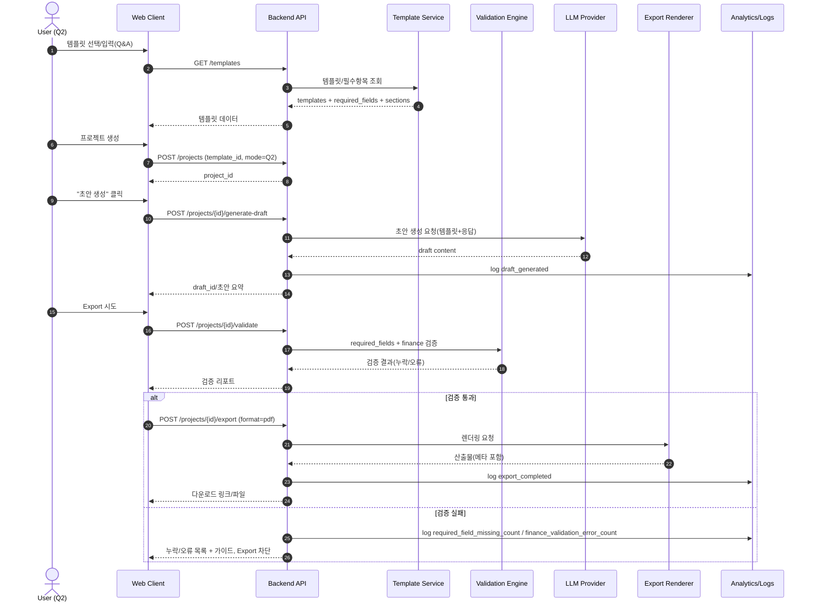
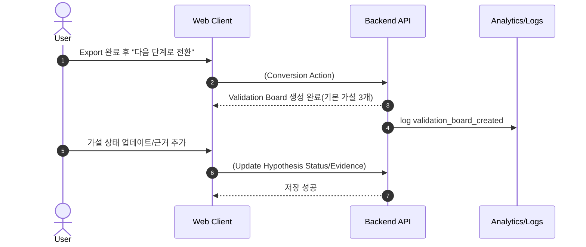
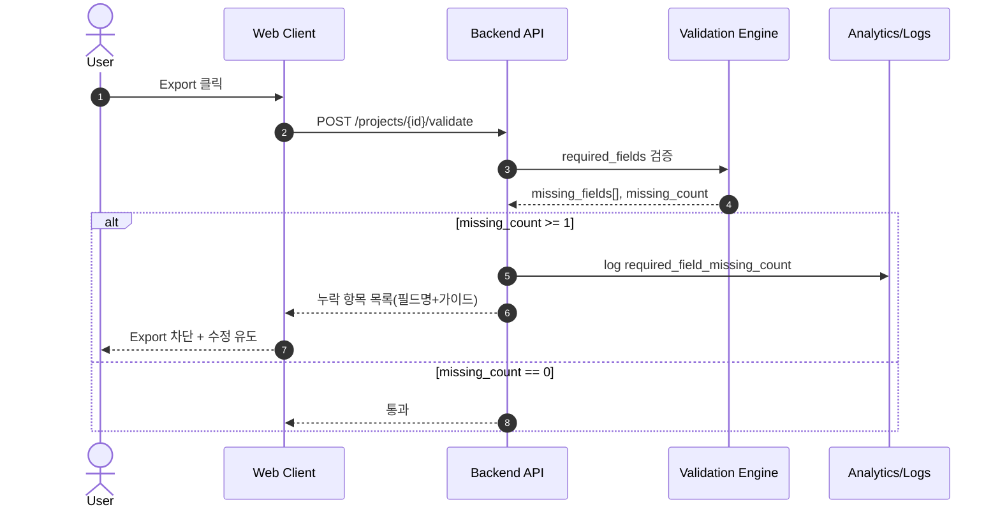
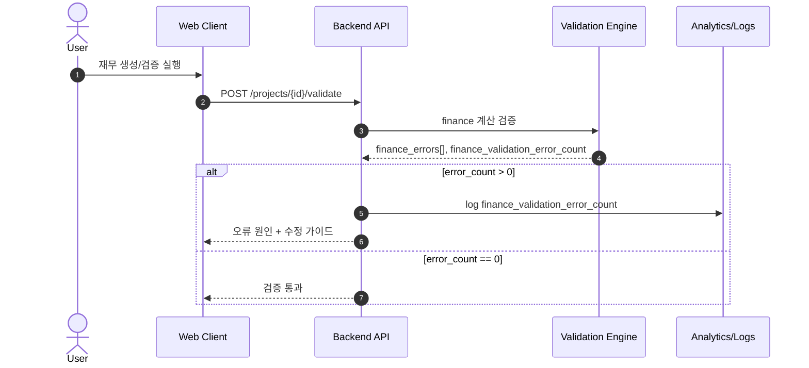
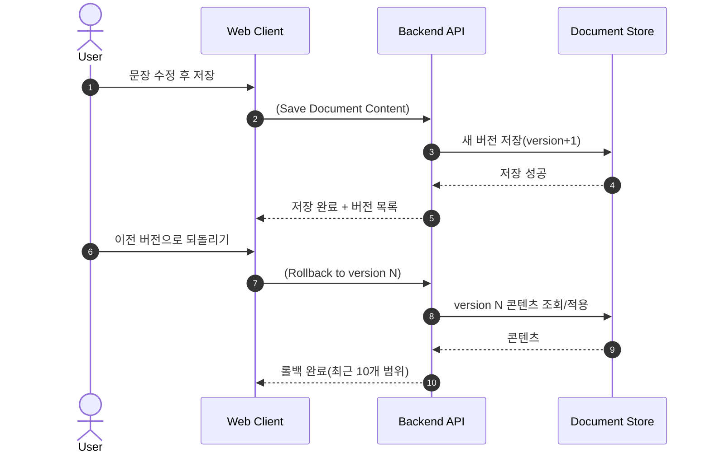
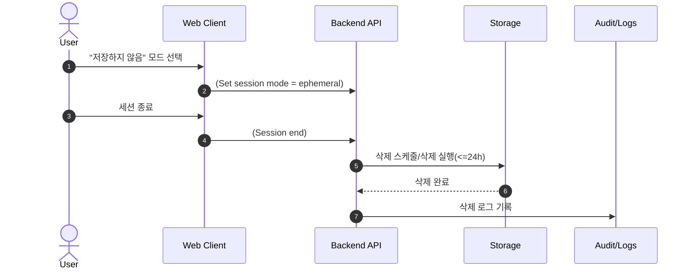

# Software Requirements Specification (SRS)
Document ID: SRS-001
Revision: 1.0
Date: 2025-12-27
Standard: ISO/IEC/IEEE 29148:2018

-------------------------------------------------
1. Introduction
   1.1 Purpose
본 문서는 “예비창업자 제출/검증 코파일럿” 시스템의 소프트웨어 요구사항을 ISO/IEC/IEEE 29148:2018에 따라 명세한다. 본 SRS는 PRD(`GPT-PRD/GPT-PRD.md`)에 정의된 문제/목표/사용자 스토리/기능/비기능/데이터·인터페이스/범위·제약/검증 계획을 유일한 요구 원천(Source of Truth)으로 하여, 완전하고 상세하며 테스트 가능하고 추적 가능한 요구사항(Functional / Non-Functional / Interface / Data / Constraints)을 제공한다.

   1.2 Scope (In-Scope / Out-of-Scope)
**In-Scope (v0.1)**
- Q2 템플릿 기반 제출본 생성(사업계획/재무) 및 검증(필수 항목, 재무/손익 산식)
- Q&A 입력 기반 초안 생성 및 문서 편집(편집기, 논리 점검, 버전 관리 최근 10개)
- Export(내보내기): 기본 PDF, (옵션) DOCX
- 보안/신뢰 패키지: 저장/삭제 모드, 정책 페이지, 감사 로그, 사용자별 접근 제어, Export 메타데이터(추적성)
- Q2→Q1 전환 “검증 보드 Lite”: 기본 가설 3개 템플릿 생성 및 상태 관리, 리마인드
- 제품 분석/측정: 이벤트 로그 및 KPI 산출을 위한 지표 수집

**Out-of-Scope (v0.1)**
- 기관/은행별 “관리자 포털” 및 템플릿 마켓플레이스(파트너용)
- 자동 크롤링 기반 시장/경쟁 데이터 수집

   1.3 Definitions, Acronyms, Abbreviations
- **Q2**: 제출/통과가 급한 예비창업자 중심의 “제출본 생성/완성(Export)” 단계.
- **Q1**: 제출 이후 “검증/실행관리” 중심 단계(가설 검증, 리스크 완화, 근거 확보).
- **PRD**: Product Requirements Document. 본 SRS의 유일한 요구 원천 문서.
- **SRS**: Software Requirements Specification.
- **AC**: Acceptance Criteria. 사용자 스토리의 인수 기준(테스트 케이스로 변환).
- **MoSCoW / MSCW**: 우선순위 분류(Must, Should, Could, Won’t).
- **KPI**: Key Performance Indicator.
- **Submit-Ready Draft Rate**: `초안 생성 후 24시간 내 Export 완료 비율` (북극성 KPI).
- **TTV (Time-to-Value)**: `draft_generated → export_completed` 소요시간.
- **p50/p90/p95**: 응답시간/지표의 백분위수(50/90/95th percentile).
- **SLA**: Service Level Agreement(가용성 목표 포함).
- **RPO/RTO**: Recovery Point Objective / Recovery Time Objective (본 PRD에서는 정량 수치 미정).
- **RBAC**: Role-Based Access Control (사용자별 프로젝트 접근 제어 포함).
- **Audit Log**: 시스템 내 주요 행위(조회/Export/삭제 등)의 감사 추적 기록.
- **Validation Board**: Q2→Q1 전환을 위한 “검증 보드(가설 카드/상태/근거)” 기능.
- **Required Fields**: 템플릿에서 Export 전에 반드시 채워야 하는 필수 항목 집합.
- **Consistency Check**: 문서 논리 점검(누락/모순/용어 정합) 및 수정 제안 제공 기능.

   1.4 References (REF-XX)
- **REF-01**: `GPT-PRD/GPT-PRD.md` (예비창업자 제출/검증 코파일럿 PRD v0.1, 2025-12-27)
- **REF-02**: `GPT-PRD/adr/ADR-0001-dual-track-q2-q1.md`
- **REF-03**: `GPT-PRD/adr/ADR-0002-generation-and-validation.md`
- **REF-04**: `GPT-PRD/adr/ADR-0003-data-retention-and-security.md`
- **REF-05**: `2_핵심예제 분석자료/GPT-ValueProPositionSheet/GPT-ValueProPositionSheet.md`
- **REF-06**: `2_핵심예제 분석자료/GPT-ValueProPositionSheet/30_JTBD_Outcome_Set.md`
- **REF-07**: `2_핵심예제 분석자료/GPT-ValueProPositionSheet/20_Persona_CJM_Summary.md`
- **REF-08**: `2_핵심예제 분석자료/GPT-ValueProPositionSheet/10_TAM-SAM-SOM_Segment_Summary.md`

-------------------------------------------------
2. Stakeholders
- **Q2 예비창업자(Primary Persona)**  
  - Responsibility: 템플릿 선택, Q&A 입력, 초안 생성/편집, Export 수행, 제출 준비  
  - Interest: 3시간 내 제출 가능 초안, 누락/재무 오류 0건, 보안/유사도 우려 해소, 편집 용이성
- **Q1 예비·초기 창업자(Secondary Persona)**  
  - Responsibility: 제출 이후 가설 생성/상태 업데이트/근거 추가, 2주 내 3개 가설 검증  
  - Interest: 데이터/근거 신뢰, 분석 해석 난이도 감소, 실행 루프 유지
- **제품/비즈니스 오너(Product/Business Owner)**  
  - Responsibility: KPI 정의/측정, 범위/우선순위 관리, 실험 설계(A/B), 롤아웃/채널 운영  
  - Interest: Submit-Ready Draft Rate, TTV, Q2→Q1 전환율, 비용/품질 균형
- **개발팀(Engineering)**  
  - Responsibility: API/데이터 모델 구현, 성능/SLA 준수, 검증 엔진, 로그/모니터링, 보안 제어  
  - Interest: 명확한 요구, 테스트 가능 기준, 운영 리스크 최소화
- **운영/지원(Ops/Support)**  
  - Responsibility: 템플릿 확장 요청 수집/처리(내부 큐), 장애 대응, 사용자 문의 대응  
  - Interest: 감사 로그/정책 일관성, 오류 원인 파악 가능성
- **보안/컴플라이언스(Security/Compliance)**  
  - Responsibility: 데이터 보존/삭제 정책 준수, 접근 통제/감사, 정책 문구 점검  
  - Interest: “학습 미사용” 정책 준수 증빙, 삭제 이행, 감사 추적성
- **데이터 분석/그로스(Data/Analytics)**  
  - Responsibility: 이벤트 스키마/대시보드, KPI 산출, 알림 기준 운영  
  - Interest: 측정 가능성, 실험 결과 신뢰도

-------------------------------------------------
3. System Context and Interfaces
   3.1 External Systems
- **LLM Provider API**: 생성/요약/리라이팅(초안 생성, 문장 개선 등) 제공. 비용/레이트리밋 정책의 영향을 받는다.
- **PDF Export Renderer**: 한글 폰트 및 표 렌더링을 포함한 PDF 산출물 생성.
- **Analytics/Logging Stack**: 제품 이벤트(`draft_generated`, `export_completed` 등), 서버 검증 로그, 대시보드 및 알림.

   3.2 Client Applications
- **Web Client(브라우저 기반)**: 템플릿 선택, Q&A 입력, 초안 생성/편집, 검증/Export, 정책 확인, Q1 검증 보드 사용.
- **Internal Operator Console(내부 운영자용, Could)**: 템플릿 “추가 요청” 처리 큐(요청 조회/상태 관리).

   3.3 API Overview
본 시스템은 다음 핵심 API를 제공한다(상세 목록은 Appendix 6.1).
- `GET /templates`: 템플릿 목록 및 필수 항목(Required Fields), 섹션(Sections) 조회
- `POST /projects`: 템플릿 선택 후 프로젝트 생성
- `POST /projects/{id}/generate-draft`: 초안 생성(비동기 가능)
- `POST /projects/{id}/validate`: 필수 항목 및 재무/손익 검증
- `POST /projects/{id}/export`: PDF(기본) / DOCX(옵션) 내보내기
- `POST /projects/{id}/delete`: 데이터 삭제(정책 준수)

   3.4 Interaction Sequences (핵심 시퀀스 다이어그램 머메이드 차트 포함)
**핵심 시퀀스 1: 템플릿 기반 초안 생성 → 검증 → Export**

**핵심 시퀀스 2: Q2→Q1 전환(검증 보드 Lite 생성)**

-------------------------------------------------
4. Specific Requirements

   4.1 Functional Requirements (테이블 필수)
| ID | Requirement (Shall) | Priority (MoSCoW) | Source (Story) | Acceptance Criteria (Given/When/Then 기반) | Verification |
|---|---|---|---|---|---|
| REQ-FUNC-001 | 시스템은 `GET /templates`를 통해 템플릿 목록, `required_fields[]`, `sections[]`를 제공해야 한다. | Must | Story 1 | Given 템플릿이 존재할 때, When 사용자가 템플릿 목록을 요청하면, Then 템플릿명/필수항목/섹션을 포함한 목록이 반환된다. | Test |
| REQ-FUNC-002 | 시스템은 템플릿별 “필수 항목 체크리스트”를 사용자에게 표시할 수 있어야 한다. | Must | Story 1 | Given 템플릿이 선택되었을 때, When 사용자가 입력 화면을 열면, Then 필수 항목 체크리스트가 표시된다. | Test |
| REQ-FUNC-003 | 시스템은 `POST /projects`로 템플릿 선택 후 프로젝트를 생성하고 `project_id`를 반환해야 한다. | Must | Story 1 | Given 사용자가 template_id와 mode(Q2/Q1)를 제공할 때, When 프로젝트를 생성하면, Then project_id가 반환된다. | Test |
| REQ-FUNC-004 | 시스템은 프로젝트에 대한 Q&A 입력(Answer)을 `field_key`, `value`로 저장할 수 있어야 한다. | Must | Story 1 | Given 사용자가 필드 값을 입력할 때, When 저장이 수행되면, Then 해당 project_id에 Answer가 저장된다. | Test |
| REQ-FUNC-005 | 시스템은 사용자가 “초안 생성”을 수행할 수 있는 기능을 제공해야 하며, 생성 성공 시 `draft_generated` 이벤트를 기록해야 한다. | Must | Story 1 | Given 사용자가 Q&A를 완료했을 때, When “초안 생성”을 누르면, Then draft가 생성되고 `draft_generated`가 기록된다. | Test |
| REQ-FUNC-006 | 시스템은 “초안 자동완성 + 즉시 데모/샘플 출력” 기능을 제공해야 한다. | Must | Story 1 | Given 사용자가 제품을 탐색할 때, When 데모/샘플을 요청하면, Then 샘플 출력이 제공된다. | Test |
| REQ-FUNC-007 | 시스템은 Export 시도 전에 필수 항목 누락 여부를 검증할 수 있어야 한다. | Must | Story 1 | Given 사용자가 Export를 시도할 때, When 검증을 수행하면, Then 필수 항목 누락 여부가 계산된다. | Test |
| REQ-FUNC-008 | 시스템은 필수 항목이 누락된 경우, 누락 항목 목록(필드명+가이드)을 표시하고 Export를 차단해야 하며 `required_field_missing_count ≥ 1`을 기록해야 한다. | Must | Story 1 | Given 필수 항목 일부가 비어 있을 때, When Export를 시도하면, Then 누락 목록이 표시되고 Export가 차단되며 누락 건수가 기록된다. | Test |
| REQ-FUNC-009 | 시스템은 Export 시점에 템플릿 필수 섹션 100% 포함(누락 0건)을 만족하는 산출물을 생성해야 하며, 성공 시 `export_completed`를 기록해야 한다. | Must | Story 1 | Given 사용자가 템플릿을 완료했을 때, When Export하면, Then 필수 섹션이 모두 포함되고 `export_completed`가 기록된다. | Test |
| REQ-FUNC-010 | 시스템은 Export 산출물에 생성 시각/템플릿/버전 메타데이터를 포함해야 한다. | Must | Story 4 | Given 사용자가 Export를 수행할 때, When Export가 완료되면, Then 산출물에 생성 시각/템플릿/버전 메타가 포함된다. | Inspection/Test |
| REQ-FUNC-011 | 시스템은 `POST /projects/{id}/validate`를 통해 (a) 필수 항목 검증, (b) 재무/손익 검증을 수행할 수 있어야 한다. | Must | Story 1, 2 | Given 검증 요청이 있을 때, When validate를 호출하면, Then 필수항목 및 재무 검증 결과가 반환된다. | Test |
| REQ-FUNC-012 | 시스템은 사용자의 매출/원가/고정비 등 입력을 기반으로 재무/손익 표를 생성할 수 있어야 한다. | Must | Story 2 | Given 정상 입력이 제공될 때, When “재무 생성”을 실행하면, Then 재무/손익 산출물이 생성된다. | Test |
| REQ-FUNC-013 | 시스템은 산출된 재무/손익 표의 합계/연산에 대한 계산 검증을 수행해야 하며, 검증 실패 시 오류 원인 및 수정 가이드를 제공해야 한다. | Must | Story 2 | Given 재무 생성이 수행될 때, When 계산 검증을 수행하면, Then 오류 0건이면 통과하고, 실패 시 원인+가이드를 제공한다. | Test |
| REQ-FUNC-014 | 시스템은 숫자 필드에 문자/음수 등 비정상 입력을 저장/생성 단계에서 거부해야 하며, 클라이언트/서버 양쪽에서 오류 메시지를 제공해야 한다. | Must | Story 2 | Given 비정상 입력이 있을 때, When 저장/생성을 시도하면, Then 클라이언트/서버 검증으로 거부되고 오류 메시지가 제공된다. | Test |
| REQ-FUNC-015 | 시스템은 Export 시 재무 섹션을 포함해야 하며, 주요 지표(매출/비용/손익)의 일관성을 유지해야 한다. | Must | Story 2 | Given 입력이 정상일 때, When 재무 섹션을 Export하면, Then 재무 섹션 포함 및 주요 지표 일관성이 유지된다. | Test |
| REQ-FUNC-016 | 시스템은 초안이 존재할 때 섹션 단위로 편집 가능한 형태를 제공해야 한다. | Must | Story 3 | Given 초안이 생성되어 있을 때, When 사용자가 섹션을 클릭하면, Then 편집 가능한 형태로 로드된다. | Test |
| REQ-FUNC-017 | 시스템은 문서 내용 변경사항을 저장할 수 있어야 한다. | Must | Story 3 | Given 사용자가 문장을 수정했을 때, When 저장하면, Then 변경사항이 저장된다. | Test |
| REQ-FUNC-018 | 시스템은 “논리 점검(Consistency Check)”을 실행할 수 있어야 하며 최소 3개 타입(누락/모순/용어정합)의 결과 및 수정 제안을 제공해야 한다. | Should | Story 3 | Given 사용자가 문장을 수정했을 때, When 논리 점검을 실행하면, Then 누락/모순/용어정합 결과와 제안을 제공한다. | Test |
| REQ-FUNC-019 | 시스템은 문서 버전을 생성/관리해야 하며 직전 10개 버전까지 되돌리기를 제공해야 한다. | Must | Story 3 | Given 사용자가 변경사항을 저장할 때, When 버전이 생성되면, Then 최근 10개까지 롤백 가능해야 한다. | Test |
| REQ-FUNC-020 | 시스템은 사용자가 “저장하지 않음(세션 종료 시 삭제)” 모드를 선택할 수 있어야 한다. | Must | Story 4 | Given 사용자가 보안 모드를 선택할 때, When “저장하지 않음”을 선택하면, Then 해당 모드가 적용된다. | Test |
| REQ-FUNC-021 | 시스템은 `POST /projects/{id}/delete`를 제공해야 하며, 삭제 요청을 처리할 수 있어야 한다. | Must | Story 4 | Given 사용자가 삭제를 요청할 때, When delete API를 호출하면, Then 삭제 처리가 시작/완료된다. | Test |
| REQ-FUNC-022 | 시스템은 “내 데이터 학습 미사용” 정책을 포함한 정책 페이지에서 수집 항목/보존 기간/삭제 방법을 명확히 표시해야 한다. | Must | Story 4 | Given 사용자가 정책 페이지를 열 때, When 페이지가 로드되면, Then 수집 항목/보존 기간/삭제 방법이 표시된다. | Inspection/Test |
| REQ-FUNC-023 | 시스템은 Export 완료 시점에 “다음 단계로 전환” 동작을 제공해야 한다. | Should | Story 5 | Given Export가 완료되었을 때, When 사용자가 “다음 단계로 전환”을 누르면, Then 전환이 시작된다. | Test |
| REQ-FUNC-024 | 시스템은 전환 시 “기본 가설 카드 3개 템플릿(고객/시장/가격)”을 생성해야 한다. | Should | Story 5 | Given Export가 완료되었을 때, When 전환을 수행하면, Then 기본 가설 카드 3개가 생성된다. | Test |
| REQ-FUNC-025 | 시스템은 가설 카드에 근거(링크/메모)를 추가할 수 있어야 한다. | Should | Story 5 | Given 사용자가 근거를 추가할 때, When 저장하면, Then 링크/메모가 저장된다. | Test |
| REQ-FUNC-026 | 시스템은 가설의 검증 상태를 `Backlog/In Test/Validated/Invalidated` 중 하나로 저장해야 한다. | Should | Story 5 | Given 사용자가 상태를 업데이트할 때, When 업데이트를 수행하면, Then 상태가 4개 중 하나로 저장된다. | Test |
| REQ-FUNC-027 | 시스템은 Export 후 14일 경과 시 미검증 가설이 남아 있으면 주간 리마인드(인앱)를 표시해야 한다. | Should | Story 5 | Given 14일이 경과했을 때, When 미검증 가설이 존재하면, Then 주간 리마인드가 표시된다. | Test |
| REQ-FUNC-028 | 시스템은 템플릿 “추가 요청” 폼을 제공하고 요청을 내부 운영자 큐로 전달할 수 있어야 한다. | Could | (PRD 기능: Could) | Given 사용자가 새 템플릿 요청을 할 때, When 요청을 제출하면, Then 요청이 운영자 큐로 전달된다. | Test |
| REQ-FUNC-029 | 시스템은 Export 포맷으로 기본 PDF를 제공해야 한다. | Must | Story 1 | Given 사용자가 Export를 수행할 때, When Export가 완료되면, Then PDF 산출물이 제공된다. | Test |
| REQ-FUNC-030 | 시스템은 Export 포맷으로 DOCX 옵션을 제공할 수 있어야 한다. | Could | (PRD 기능: Could) | Given DOCX 옵션이 제공될 때, When 사용자가 DOCX로 Export하면, Then DOCX 산출물이 제공된다. | Test |

   4.2 Non-Functional Requirements (테이블 필수)
| ID | Category | Requirement (Shall) | Metric/Target | Measurement/Instrumentation | Priority | Source |
|---|---|---|---|---|---|---|
| REQ-NF-001 | Performance | 시스템은 초안 생성 요청에 대해 p95 응답시간을 만족해야 한다. | p95 ≤ 60,000ms | API 레이턴시 메트릭(엔드포인트별 p95) | Must | Story 1 AC, PRD NFR |
| REQ-NF-002 | Performance | 시스템은 편집기 로드 p95 응답시간을 만족해야 한다. | p95 ≤ 2,000ms | 클라이언트 성능 측정 + 서버 응답시간 | Must | Story 3 AC, PRD NFR |
| REQ-NF-003 | Performance | 시스템은 템플릿/체크리스트 조회 p95 응답시간을 만족해야 한다. | p95 ≤ 800ms | API 레이턴시 메트릭 | Must | PRD NFR |
| REQ-NF-004 | Availability | 시스템은 월 가용성을 만족해야 한다. | 월 ≥ 99.5% | 업타임 모니터링/상태 페이지 지표 | Must | PRD NFR |
| REQ-NF-005 | Reliability | 시스템은 API 5xx 오류율을 만족해야 한다. | 5xx ≤ 0.5% | API 응답 코드 모니터링(분모=전체 요청) | Must | PRD NFR |
| REQ-NF-006 | Reliability | 시스템은 Export 실패율을 만족해야 한다. | 실패율 ≤ 1.0% | ExportJob 상태 기반 지표 | Must | PRD NFR |
| REQ-NF-007 | Security/Data Retention | “저장하지 않음” 모드에서 세션 종료 후 서버 저장 데이터는 삭제되어야 한다. | 24시간 이내 삭제 | 삭제 작업 로그 + 감사 로그 | Must | Story 4 AC, PRD NFR |
| REQ-NF-008 | Security/Data Retention | 기본 저장 모드에서 데이터 보존 기간을 만족해야 한다. | 보존 30일, 사용자 요청 시 즉시 삭제 | 데이터 TTL/삭제 로그 | Must | PRD NFR |
| REQ-NF-009 | Security/Access Control | 시스템은 사용자별 프로젝트 접근 제어를 적용해야 한다. | 무단 접근 0건(정책/테스트 기준) | 접근 제어 테스트, 감사 로그 | Must | PRD NFR |
| REQ-NF-010 | Security/Auditability | 시스템은 조회/Export/삭제에 대한 감사 로그를 남겨야 한다. | 로그 누락 0건(정의된 액션 기준) | AuditLog 테이블/로그 파이프라인 | Must | PRD NFR |
| REQ-NF-011 | Privacy/Policy | 시스템은 사용자 입력/산출물을 모델 학습에 사용하지 않아야 한다(정책 명문화). | 정책 페이지에 명시(REQ-FUNC-022) | 정책 문구 점검(Inspection) | Must | PRD NFR |
| REQ-NF-012 | Cost | 시스템은 생성 비용(요청당 토큰/원가)을 모니터링해야 하며, 일일 예산 초과 시 기능 제한을 적용할 수 있어야 한다. | “예산 초과 시 제한” 동작 제공 | 비용 메트릭 + 제한 이벤트 로그 | Must | PRD NFR |
| REQ-NF-013 | Observability | 시스템은 KPI/품질 지표 산출에 필요한 이벤트/로그를 기록해야 한다. | `time_to_export_minutes`, `required_field_missing_count`, `finance_validation_error_count` 기록 | 이벤트 로그/서버 검증 로그 | Must | PRD KPI/NFR |
| REQ-NF-014 | Alerting | 시스템은 다음 알림 기준을 지원해야 한다. | draft p95>90s(15m), Export 실패>2%(30m), 5xx>1%(15m) | 알림 룰 설정/운영 | Should | PRD NFR |
| REQ-NF-015 | Product KPI | 시스템은 베타(4주)에서 TTV 목표를 만족하도록 설계/운영되어야 한다. | p50 ≤ 180분, p90 ≤ 360분 | 이벤트 기반 TTV 계산 | Must | PRD KPI |
| REQ-NF-016 | Product KPI | 시스템은 Submit-Ready Draft Rate 목표를 측정 가능해야 한다. | 24시간 내 Export 비율 ≥ 60% (베타 4주) | `draft_generated`, `export_completed`, 시간 측정 | Must | PRD KPI |
| REQ-NF-017 | Data Quality | 시스템은 Export 시점 “필수 항목 누락 0건” 목표를 만족해야 한다. | 누락 0건 비율 ≥ 90% | required_field_missing_count 로그 | Must | PRD KPI |
| REQ-NF-018 | Data Quality | 시스템은 재무 계산 오류 0건 목표를 만족해야 한다. | 오류 0건 비율 ≥ 95% | finance_validation_error_count 로그 | Must | PRD KPI |
| REQ-NF-019 | Product KPI | 시스템은 Q2→Q1 전환율 목표를 측정/달성하도록 설계되어야 한다. | ≥ 15% (Export 후 14일 내 보드 생성) | `validation_board_created` / Export | Should | PRD KPI |

-------------------------------------------------
5. Traceability Matrix
| Story ID | Story Summary | Requirement ID(s) | Test Case ID(s) |
|---|---|---|---|
| Story 1 | 템플릿 선택+Q&A로 3시간 내 제출 가능한 초안 Export | REQ-FUNC-001~011, 029~030; REQ-NF-001~003, 013, 015~017 | TC-001~TC-010 |
| Story 2 | 재무/손익 자동 생성 및 계산 검증 | REQ-FUNC-011~015; REQ-NF-018 | TC-011~TC-015 |
| Story 3 | 편집기, 논리 점검, 버전(최근 10개) | REQ-FUNC-016~019; REQ-NF-002 | TC-016~TC-020 |
| Story 4 | 보안/신뢰(저장/삭제 옵션, 정책, 메타데이터) | REQ-FUNC-010, 020~022; REQ-NF-007~011 | TC-021~TC-026 |
| Story 5 | Q2→Q1 전환: 가설 3개 템플릿, 상태/근거, 리마인드 | REQ-FUNC-023~027; REQ-NF-019 | TC-027~TC-031 |

**Test Case Catalog (요약)**
- **TC-001**: 템플릿 목록 조회 시 required_fields/sections 포함 반환
- **TC-002**: 템플릿 선택 시 필수 항목 체크리스트 표시
- **TC-003**: 프로젝트 생성 시 project_id 반환
- **TC-004**: Q&A 입력 저장 성공
- **TC-005**: 초안 생성 성공 및 `draft_generated` 이벤트 기록(REQ-NF-001 포함 성능 측정)
- **TC-006**: Export 전 validate 수행 및 리포트 반환
- **TC-007**: 필수 항목 누락 시 Export 차단 + 누락 목록/가이드 + 누락 카운트 기록
- **TC-008**: 필수 항목 충족 시 Export 성공 및 `export_completed` 기록
- **TC-009**: Export 산출물에 생성시각/템플릿/버전 메타 포함
- **TC-010**: PDF Export 제공
- **TC-011**: 재무/손익 생성 수행
- **TC-012**: 계산 검증 통과(오류 0건)
- **TC-013**: 계산 검증 실패 시 원인/수정 가이드 제공
- **TC-014**: 숫자 필드 비정상 입력(문자/음수) 클라/서버에서 거부
- **TC-015**: Export 시 재무 섹션 포함 및 주요 지표 일관성 유지
- **TC-016**: 편집기 섹션 로드(REQ-NF-002 성능 측정 포함)
- **TC-017**: 문서 편집 저장 성공
- **TC-018**: Consistency Check 결과에 누락/모순/용어정합 포함 + 수정 제안
- **TC-019**: 버전 생성 및 최근 10개 롤백
- **TC-020**: 롤백 후 콘텐츠 일치 확인
- **TC-021**: “저장하지 않음” 모드 선택 및 세션 종료 후 24h 내 삭제 확인(REQ-NF-007)
- **TC-022**: delete API 호출로 즉시 삭제 처리(REQ-NF-008)
- **TC-023**: 정책 페이지에 수집 항목/보존 기간/삭제 방법 표시
- **TC-024**: 사용자별 접근 제어(타 사용자 프로젝트 접근 거부)
- **TC-025**: 감사 로그(조회/Export/삭제) 누락 없이 기록
- **TC-026**: “학습 미사용” 정책 명시 존재 확인
- **TC-027**: Export 후 전환 동작 제공
- **TC-028**: 전환 시 가설 3개 템플릿 생성 및 `validation_board_created` 기록
- **TC-029**: 가설 상태 업데이트 4개 값만 허용
- **TC-030**: 근거(링크/메모) 추가 저장
- **TC-031**: 14일 경과 + 미검증 가설 존재 시 주간 인앱 리마인드 노출

-------------------------------------------------
6. Appendix
   6.1 API Endpoint List
| Endpoint | Purpose | Inputs (Key) | Outputs (Key) | Notes/Constraints |
|---|---|---|---|---|
| GET /templates | 템플릿 목록/필수 항목/섹션 조회 | - | `Template[]` | p95 ≤ 800ms (REQ-NF-003) |
| POST /projects | 프로젝트 생성 | `template_id`, `mode(Q2/Q1)` | `project_id` | 사용자별 접근 제어 적용(REQ-NF-009) |
| POST /projects/{id}/generate-draft | 초안 생성 | `project_id` | `document_id`/초안 | p95 ≤ 60s (REQ-NF-001), `draft_generated` 기록 |
| POST /projects/{id}/validate | 필수 항목/재무 검증 | `project_id` | 누락/오류 리포트 | 누락 시 Export 차단 근거(REQ-FUNC-008) |
| POST /projects/{id}/export | Export 생성(PDF/DOCX) | `format(pdf/docx)` | 산출물/링크 | 기본 PDF(Must), DOCX(Could), 메타 포함(REQ-FUNC-010) |
| POST /projects/{id}/delete | 데이터 삭제 | `project_id` | 삭제 처리 결과 | 24h 내 삭제(세션 모드) / 30일 보존(기본)(REQ-NF-007/008) |

   6.2 Entity & Data Model (표 필수)
| Entity | Primary Key | Fields (from PRD) | Description |
|---|---|---|---|
| User | `user_id` | `segment(Q1/Q2)`, `consent_flags` | 사용자 식별 및 세그먼트/동의 플래그 |
| Project | `project_id` | `template_id`, `mode(Q2/Q1)`, `created_at` | 템플릿 기반 작업 단위 |
| Template | `template_id` | `name`, `required_fields[]`, `sections[]` | 기관/목적별 템플릿 정의 |
| Answer | (composite) | `project_id`, `field_key`, `value`, `validated(bool)` | Q&A 입력 데이터 |
| Draft/DocumentVersion | `document_id` | `version`, `content`, `created_at` | 문서 버전 관리(최근 10개 롤백) |
| ExportJob | `export_id` | `format(pdf/docx)`, `status`, `completed_at` | Export 작업 추적 |
| AuditLog | (id) | `actor_id`, `action`, `resource_id`, `timestamp` | 조회/Export/삭제 등의 감사 추적 |

   6.3 Detailed Interaction Models
**상세 시퀀스 A: 필수 항목 누락으로 Export 차단**

**상세 시퀀스 B: 재무 검증 실패 시 원인/가이드 제공**

**상세 시퀀스 C: 편집 저장 → 버전 생성 → 10개 롤백**

**상세 시퀀스 D: “저장하지 않음” 모드 세션 종료 후 삭제(24h)**

**Constraints / Assumptions (PRD 기반 통합)**
- **LLM 제공자 정책/비용/레이트리밋**은 초안 생성 성능 및 비용(REQ-NF-001, REQ-NF-012)에 직접 영향을 준다.
- **PDF Export 품질(한글 폰트/표 렌더링)**은 Export 성공률(REQ-NF-006)에 영향을 준다.
- **리스크 1(환각/논리 오류)**: 필수 항목/재무는 규칙 기반 검증 및 논리 점검 리포트로 완화(REF-03).
- **리스크 2(보안/유사도 우려)**: 저장/삭제 옵션, 정책 명문화, 감사 로그, 메타데이터로 완화(REF-04).
- **리스크 3(Q2 자연 이탈)**: Export 직후 전환 플로우 및 검증 보드 제공(REF-02).
- **가정 A**: “3시간 내 제출본” 가치가 유료 전환을 유도한다(베타 실험으로 검증).
- **가정 B**: 재무 검증 제공이 “숫자 공포”를 감소시킨다(설문+오류율로 검증).

